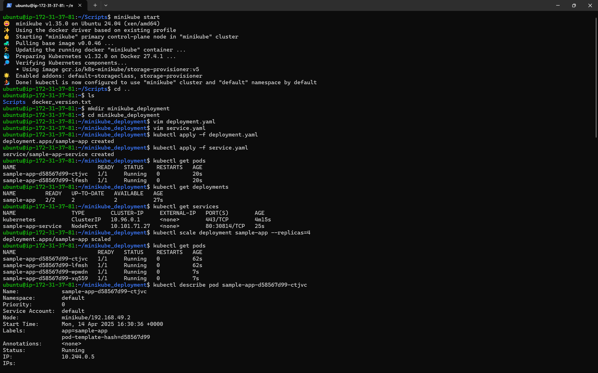
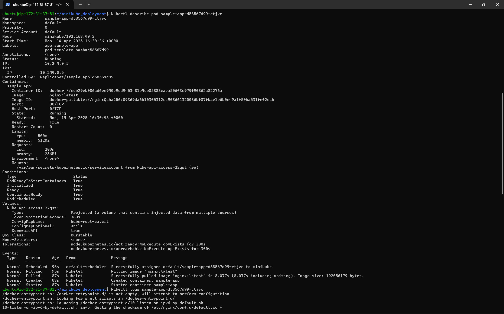
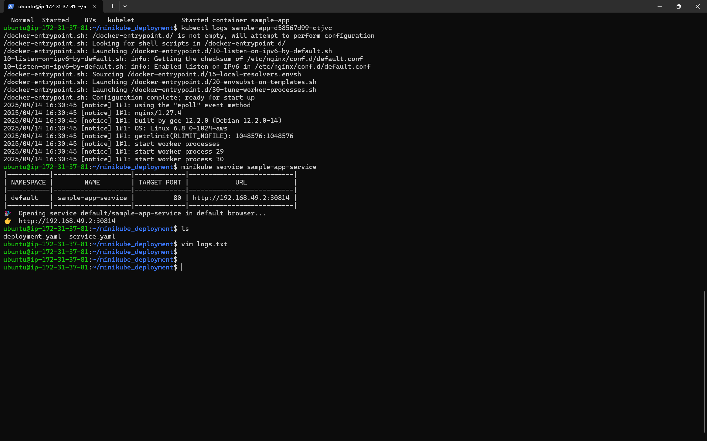
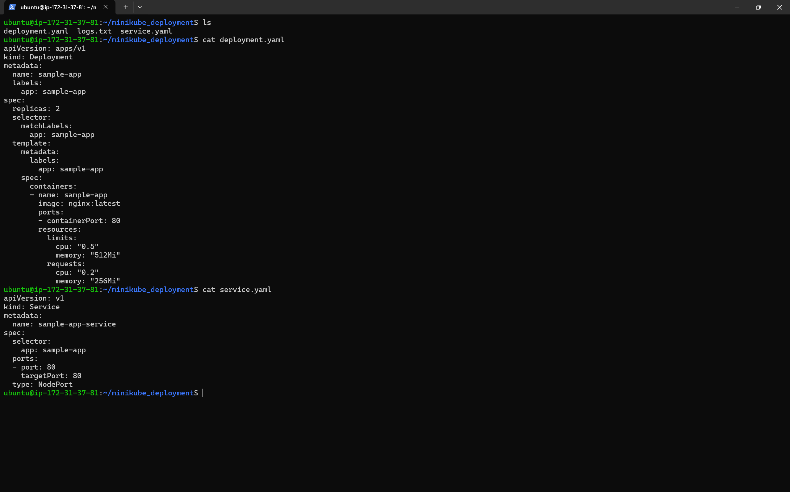

# Kubernetes Local Cluster Setup with Minikube

This repository contains the necessary files and instructions to set up a local Kubernetes cluster using Minikube, deploy a sample application, and perform basic Kubernetes operations. This project is part of DevOps Internship Task 5 focused on learning Kubernetes basics.

## Project Overview

This project demonstrates how to:
- Set up a local Kubernetes cluster using Minikube
- Create and deploy applications using YAML configurations
- Expose applications through services
- Scale deployments
- Use ConfigMaps for application configuration
- Monitor and troubleshoot deployments

## Prerequisites

- Docker installed
- Minikube
- kubectl CLI tool
- 2+ GB of free memory and 20 GB of free disk space
- A hypervisor (like VirtualBox, Hyper-V, or KVM)

## Installation Steps

### 1. Install Minikube and kubectl

#### Linux:
```bash
# Install kubectl
curl -LO "https://dl.k8s.io/release/$(curl -L -s https://dl.k8s.io/release/stable.txt)/bin/linux/amd64/kubectl"
chmod +x kubectl
sudo mv kubectl /usr/local/bin/

# Install Minikube
curl -LO https://storage.googleapis.com/minikube/releases/latest/minikube-linux-amd64
sudo install minikube-linux-amd64 /usr/local/bin/minikube
```

#### macOS:
```bash
# Install kubectl
brew install kubectl

# Install Minikube
brew install minikube
```

#### Windows:
```powershell
# Install kubectl
curl -LO "https://dl.k8s.io/release/v1.27.1/bin/windows/amd64/kubectl.exe"

# Install Minikube (using chocolatey)
choco install minikube
```

### 2. Start Minikube Cluster

```bash
minikube start
```

## Deployment Process

### 1. Create Deployment

The `deployment.yaml` file defines an NGINX web server with resource constraints and replicas:

```yaml
apiVersion: apps/v1
kind: Deployment
metadata:
  name: sample-app
  labels:
    app: sample-app
spec:
  replicas: 2
  selector:
    matchLabels:
      app: sample-app
  template:
    metadata:
      labels:
        app: sample-app
    spec:
      containers:
      - name: sample-app
        image: nginx:latest
        ports:
        - containerPort: 80
        resources:
          limits:
            cpu: "0.5"
            memory: "512Mi"
          requests:
            cpu: "0.2"
            memory: "256Mi"
```

Deploy with:
```bash
kubectl apply -f deployment.yaml
```

### 2. Expose the Application

The `service.yaml` file creates a NodePort service to make the application accessible:

```yaml
apiVersion: v1
kind: Service
metadata:
  name: sample-app-service
spec:
  selector:
    app: sample-app
  ports:
  - port: 80
    targetPort: 80
  type: NodePort
```

Deploy with:
```bash
kubectl apply -f service.yaml
```

### 3. Verify the Deployment

Check if pods are running correctly:

```bash
# Check running pods
kubectl get pods

# Check deployments
kubectl get deployments

# Check services
kubectl get services
```

### 4. Scale the Deployment

Increase the number of replicas to handle more traffic:

```bash
kubectl scale deployment sample-app --replicas=4
```


## File Structure

- `deployment.yaml`: Basic NGINX deployment with resource limits and requests
- `service.yaml`: NodePort service to expose the application
- `logs.txt`: Command outputs and logs from the implementation

## Implementation Screenshots

### Minikube Startup and Deployment

*Screenshot shows the successful startup of Minikube and the creation of deployments and services*

### Pod Description and Container Details

*Screenshot shows detailed information about the running pod including resources, status and events*

### Service Exposure and Logs

*Screenshot shows the service being exposed via NodePort and the logs of the NGINX container*

### YAML Configuration Files

*Screenshot shows the content of deployment.yaml and service.yaml files*

## Implementation Details and Commands

Based on the actual implementation, here are the exact steps followed:

1. **Start Minikube**:
   ```bash
   minikube start
   ```
   Using the Docker driver on Ubuntu 24.04 with Kubernetes v1.32.0.

2. **Create and Apply Configuration Files**:
   ```bash
   mkdir minikube_deployment
   cd minikube_deployment
   vim deployment.yaml
   vim service.yaml
   kubectl apply -f deployment.yaml
   kubectl apply -f service.yaml
   ```

3. **Verify Deployment**:
   ```bash
   kubectl get pods
   # Output showed 2 pods running: sample-app-d58567d99-ctjvc and sample-app-d58567d99-lfmsh
   
   kubectl get deployments
   # Output showed 1 deployment with 2/2 pods ready
   
   kubectl get services
   # Output showed the sample-app-service exposed on port 30814
   ```

4. **Scale Deployment**:
   ```bash
   kubectl scale deployment sample-app --replicas=4
   kubectl get pods
   # Output showed 4 pods running after scaling
   ```

5. **Check Pod Details**:
   ```bash
   kubectl describe pod sample-app-d58567d99-ctjvc
   # Showed detailed pod information including QoS class: Burstable
   
   kubectl logs sample-app-d58567d99-ctjvc
   # Showed NGINX startup logs
   ```

6. **Access the Application**:
   ```bash
   minikube service sample-app-service
   # Opened the service in browser at http://192.168.49.2:30814
   ```

## Kubernetes Concepts Learned

- **Pods**: Smallest deployable units in Kubernetes
- **Deployments**: Manage replicas and updates of pods
- **Services**: Expose applications to network traffic
- **ConfigMaps**: Store non-confidential configuration data
- **Scaling**: Adjust resources to meet demand
- **Rolling Updates**: Update applications with zero downtime

## Next Steps

- Implement persistent volumes for data storage
- Set up Horizontal Pod Autoscaler
- Configure health checks and readiness probes
- Create multi-container pods
- Deploy a stateful application

## Resources

- [Kubernetes Documentation](https://kubernetes.io/docs/home/)
- [Minikube Documentation](https://minikube.sigs.k8s.io/docs/)
- [kubectl Cheat Sheet](https://kubernetes.io/docs/reference/kubectl/cheatsheet/)